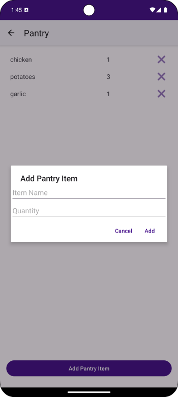

# Pantry Buddy

**Pantry Buddy** is an Android application designed to help users manage their pantry inventory, reduce food waste, receive recipe recommendations based on available ingredients, and keep an organized grocery shopping list.

## Features

- **Pantry Tracking**: Easily add, update, and remove pantry items. Track quantities and expiration dates to minimize waste.  
- **Recipe Suggestions**: Get personalized recipe ideas based on current pantry contents using the Edamam Recipe API.  
- **Grocery List Management**: Maintain a dynamic grocery list and transfer purchased items directly to the pantry.  
- **Expiration Alerts**: Visually highlighted expiration status helps users spot items that are near or past their expiration date.  
- **Data Persistence**: All user data is stored locally using an SQLite database for offline access and reliability.  
- **Smart Additions**: Prevents duplicate entries by updating quantities of existing items instead of duplicating them.  
- **API Call Optimization**: Implements caching for recipe suggestions to reduce unnecessary API requests and improve performance.  

## System Requirements

- **Minimum Android Version**: Android 5.0 Lollipop (SDK 21)  
- **Development Environment**: Android Studio Arctic Fox or later  
- **Programming Language**: Java  
- **Key Libraries Used**:  
  - [Retrofit](https://square.github.io/retrofit/) – for API integration
  - [Gson](https://github.com/google/gson) – for JSON parsing
  - SQLite for local data storage  

## Architecture

The app follows the **Model-View-Controller (MVC)** design pattern:

- **Model**: Handles data logic and API communication.  
- **View**: Includes the UI components such as Activities, RecyclerViews, Dialogs.  
- **Controller**: Bridges interaction logic between View and Model (e.g., updating the pantry list, fetching recipes).  

## Main Screens

### 🏠 Home Screen

The landing screen features three navigation buttons:
- **Pantry** – Manage pantry inventory  
- **Grocery List** – Manage shopping list  
- **Recipes** – View recipe suggestions  

---

### 🗃️ Pantry Screen

- View and manage pantry items (name, quantity, expiration date).  
- Add new items via a dialog form.  
- Long-press items to edit expiration dates.  
- Expiration highlights:  
  - ⚪ Grey: Safe (>3 days)
  - 🔴 Red: Expires within 3 days
  - ❗ “EXPIRED” label for expired items  
  - No label for items without expiration dates  

---

### 🍲 Recipe Screen

- Automatically suggests recipes based on current pantry contents.  
- Fetches up to 20 relevant recipes via the Edamam API.  
- Each recipe card displays a title and image.  
- Clicking on a recipe reveals ingredients and a link to full instructions.  

---

### 🛒 Grocery List Screen

- Add, remove, and edit grocery list items.  
- Transfer items to pantry when purchased.  
- Intelligent updates: quantities are increased if the item already exists.  

---

## Screenshots

  
*Home Screen with navigation buttons*

  
*Pantry list with expiration highlights*

  
*Dialog for adding a new pantry item*

  
*List of recipe cards fetched from the API*

  
*Detailed view showing ingredients and link*

  
*Grocery list management view*

---

## Future Improvements

- Notifications for upcoming expirations  
- Barcode scanning for faster item entry  
- Quickly add missing recipe items to shopping list  
- User authentication and cloud sync  

---

## License

This project is for academic purposes and is not currently licensed for commercial use.

---

## Credits

This app was developed as part of a university project for an educational course on Android development. API powered by [Edamam](https://developer.edamam.com/).
